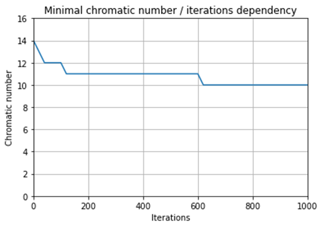

# Artificial Bee Colony Algorithm
This repository is Artificial Bee Colony Algorithm implementation for graph coloring and finding minimal chromatic number in C++. It is based on article ["Vertex Coloring Based on Artificial Bee Colony Algorithm"](https://omirzaei.github.io/assets/pdf/C2.pdf) by Vahid Chahkandi and Omid Mirzaei.

Random 150-vertexes graph is generated with vertex degrees from 1 up to 30. Algorithm runs 1000 times. Each iteration can improve our minimal chromatic number. This diagram shows the quality of the result solution on every 20 iterations from 0 to 1000 

